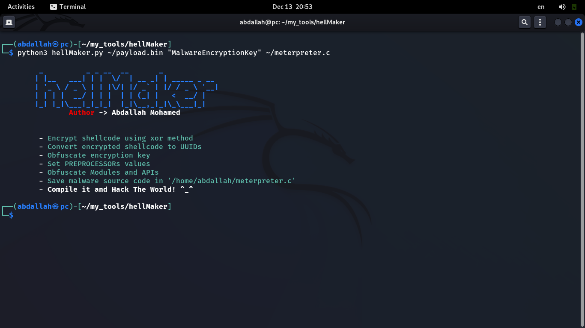
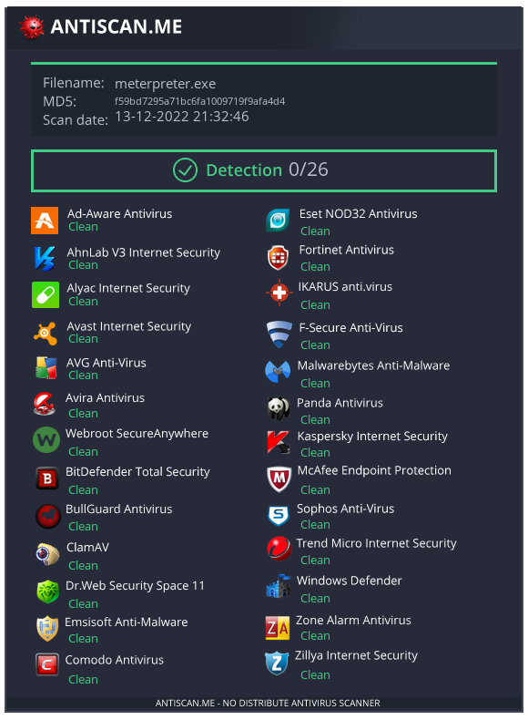

# hellMaker
hellMaker is a tool for generating fully undetectable malwares for any C&C tool you want, it uses several evasion techniques.

## Features
- shellcode encryption using xor method
- shellcode UUID Obfuscation
- IAT Hiding & Obfuscation
- Bypass memory monitoring
- Evade behavior analysis and sandbox using several techniques
- Obfuscate all static stuff using random key
- Anti Debugging
- Process UnHooking
- Get ntdll base address without using GetModuleHandle/LoadLibrary
- No new thread execution

## Installation
- Git clone this repo
- Change dir into the folder
- The tool doesn't require any dependencies
- Run `python3 hellMaker.py`

## Usage
First, you need to create a raw shellcode using the C2 tool you prefer,\
then run the tool and enter the shellcode and Encryption key and the output filename.
```
┌──(user㉿hostname)-[~/path/to/hellMaker]
└─$ python3 hellMaker.py

         _          _ _ __  __       _             
        | |__   ___| | |  \/  | __ _| | _____ _ __ 
        | '_ \ / _ \ | | |\/| |/ _` | |/ / _ \ '__|
        | | | |  __/ | | |  | | (_| |   <  __/ |   
        |_| |_|\___|_|_|_|  |_|\__,_|_|\_\___|_|   
                Author -> Abdallah Mohamed                                        

    
        Usage:
                ./hellMaker.py <path/to/shellcode.bin> <EncryptionKey> <Output.c>


```

## Run


## Test


## Compile
`cl <payload>.c` using visual studio

## Warning
I am not responsible for any of your actions, this tool for educational purposes only.
